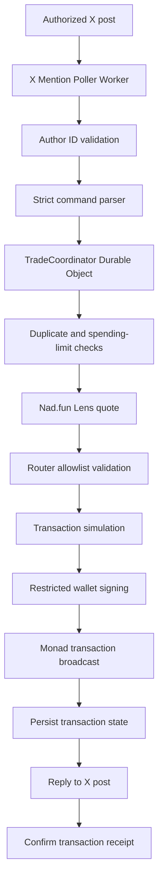

# Architecture

## System diagram

## Worker responsibilities

- Expose `GET /health`
- Run scheduled X mention polling every minute
- Forward valid commands to the Durable Object
- Post sanitized replies to X

## Durable Object responsibilities

`TradeCoordinator` serializes wallet usage and stores:

- Mention poll cursor
- Trade records keyed by tweet ID
- Hourly and daily limit counters
- Processing lock to prevent concurrent submissions

## Blockchain execution flow

1. Parse and validate command
2. Convert MON amount to wei with Viem
3. Validate token contract bytecode
4. Query Nad.fun Lens for router and expected output
5. Apply slippage with bigint math
6. Simulate transaction
7. Sign and broadcast only when dry-run is disabled and trading is enabled
8. Persist hash and confirm asynchronously

## Data flow

- X mentions enter through the poller
- One tweet maps to one trade record (`trade:v1:tweet:<tweetId>`)
- Replies are derived from trade status and sanitized error messages

## Trust boundaries

- Only `AUTHORIZED_X_USER_ID` may initiate trades
- Private key exists only in Worker secrets
- Signer may call allowlisted Nad.fun routers only
- Public X replies never include secrets, balances, or RPC URLs
